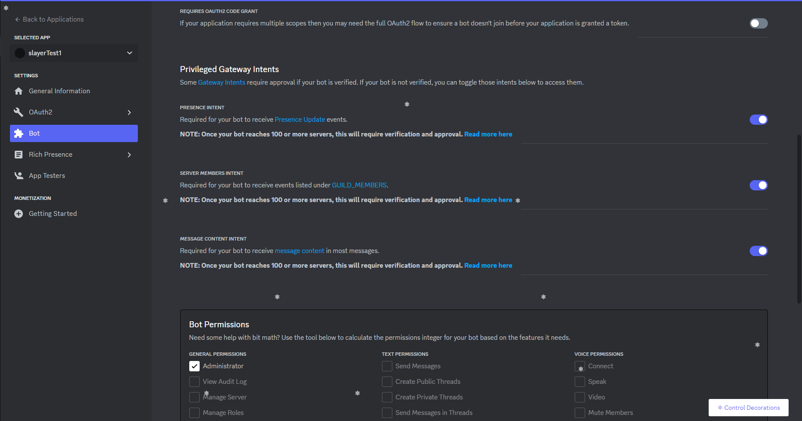
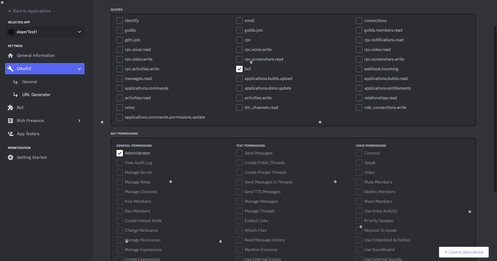
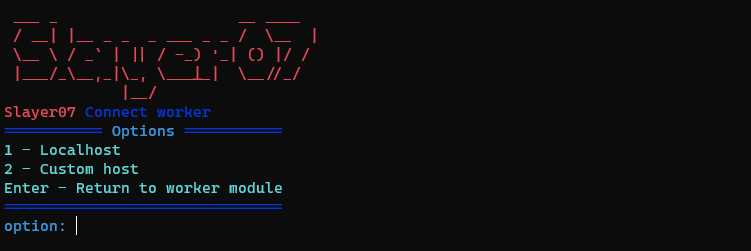
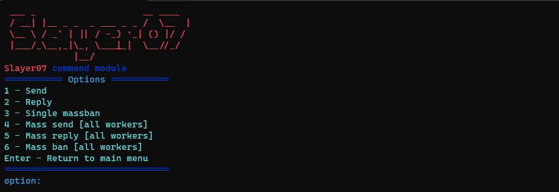

# Dicord Slayer07 setup ( FOR EDUCATIONAL PORPOSES!!! )
This is the most important repository of Slayer07, it is with it that you configure everything.

## Concepts Overview
### default.json
> each field in 'default.json' is a worker configuration, containing the worker id, discord client id and discord client  token.

> It is important to remember that the 'id' is the worker identifier, and the clientId is the discord id.

### config.py
> It is the script that configures the slayer.
it configures the bots according to the indicated configuration file, adding their id's and tokens.

> basically, it reads each of the fields in the configuration file, and makes a copy of the SlayerBaseWorker with the field information.

### install.sh
It's the installation script, run it before anything else.

## Using
For this example, we will create 3 bots in the developer portal.

It is important to activate the bot settings, as shown in the images below:



Remember to copy the bots token!!, we will use them later

> Now, invite the bots to a test server, and copy the bots ID, you can do this by activating the discord developer functions, right-clicking on the bot, and clicking "copy id"

> Perfect, now with the tokens and IDs of our bots in hand, let's move on to default.json.

> each configuration field is a different bot. For the first bot, it will have "workerId": 0, in the id's field, add the bot id that we copied to "clientId", and then the bot's token in "clientToken", then select a port for this bot, by default, 8080.

> repeat the process with the other 2 bots.
ATTENTION: Remember to change the port and workerId of the other bots, otherwise conflicts will occur.

> After configuring our default.json, run install.sh

> After that, let's run the configuration script.
```py
python3 config.py -cfg ./default.json -b
```
> The bots will be configured and built.
After that, I advise you to open 4 tabs in your terminal, 3 for the workers, and 1 for the controller.

> in the controller tab, run:
```bash
cd SlayerBaseController && npm i && npm run prepare && npm run start
```

> Then, in each of the worker tabs
```bash
cd Slayer07TrueWorker0 && npm run start
```
```bash
cd Slayer07TrueWorker1 && npm run start
```
```bash
cd Slayer07TrueWorker2 && npm run start
```

### Finally
> Navigate to 1-workers -> 3 - connect worker:


> After that, go back to the initial module and have fun with module 2 - Commands, hehe

